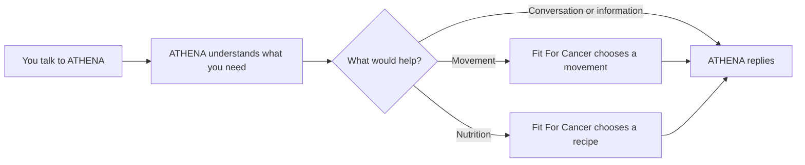
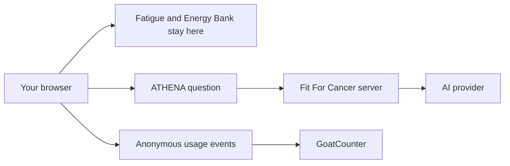

# Data & Roadmap Page Scope

## Purpose

Create a public `/data` page that does two things well:

1. shows honest, privacy-respecting usage data;
2. explains what Fit For Cancer has built and where it is heading.

This page is for users, researchers, developers and people who may want to contribute later.

It must not become a giant scrolling essay, a technical changelog, or a duplicate of the repo roadmap.

---

## Hard rules

### Language

The public roadmap must use plain English.

Do not use:

- product-management jargon;
- implementation detail;
- issue numbers;
- framework names unless they are needed in the developer section;
- vague AI/business phrases;
- tiny completed tasks that are not real roadmap milestones.

Roadmap entries should describe meaningful product work only.

### Page length and navigation

The main `/data` page is a compact index and snapshot, not a long document.

Use progressive disclosure:

- short visible summaries;
- working accordions for detail;
- jump navigation between major sections;
- only one Roadmap accordion open at a time on mobile;
- sensible keyboard and screen-reader behaviour;
- no nested accordion maze.

Nothing longer than roughly 3–4 lines should be visible by default unless it is core page content.

Yearly Wrapped reports should eventually live on their own child pages, for example `/data/2026`.

---

# Page structure

## 1. Intro

Short heading and 1–2 short paragraphs.

Suggested heading:

**Fit For Cancer, in the open**

Explain briefly that Fit For Cancer is free and open source, and that the project wants to be transparent about what people use, what is being learned and what is planned next.

Show compact jump links/cards:

- By the numbers
- Roadmap
- ATHENA Wrapped
- Researchers & developers

---

## 2. By the numbers

Show a small set of headline cards only.

Initial state:

- clearly state that analytics collection began in September 2026;
- do not invent historic numbers;
- use placeholders until enough real data exists.

Future headline metrics may include:

- ATHENA visits;
- ATHENA messages sent;
- repeat ATHENA check-ins;
- Nutrition recipe opens;
- most-opened recipes;
- Movement engagement once there is a real interaction worth measuring;
- cancer-category selections;
- broad device or country information where genuinely useful.

### Cancer category wording

Do not say:

> 38% of our visitors have breast cancer.

Use wording such as:

> Of people who selected a cancer type in Fit For Cancer, 38% selected breast cancer.

The analytics measure selections, not verified diagnoses.

### Progressive disclosure

Keep these collapsed by default:

- **How we count this**
- **Privacy and limitations**
- **Running costs**

### Privacy principle

Use a short visible line such as:

**Useful data, not personal profiles.**

Explain in plain English that aggregate usage data is collected, but fatigue scores, Energy Bank history, ATHENA conversation content, Quick Notes and names are not sent to analytics.

Cancer-category selections are collected only when explicitly selected.

---

## 3. ATHENA Wrapped 2026

Show one visually distinct placeholder card.

Suggested heading:

**ATHENA WRAPPED 2026**

Suggested supporting line:

> Coming at the end of the year.

The future Wrapped should be lightweight, honest and interesting rather than corporate reporting.

Possible future items:

- most popular recipe;
- most popular Movement item once that can be measured honestly;
- ATHENA conversations or messages;
- repeat check-ins;
- cancer-category mix;
- AI inference spend;
- Ko-fi support;
- a few light observations about how the app is actually being used.

The annual report should later move to a separate page such as `/data/2026`.

---

# 4. Roadmap

Use one accordion group with three sections.

The roadmap is public-facing and must remain short.

## What we’ve built

### ATHENA rebuilt from the ground up

ATHENA has been rebuilt into the main conversational tool in Fit For Cancer, with better reliability, clearer boundaries and stronger links to Movement and Nutrition.

### A rebuilt prompting brain

The way ATHENA understands questions, keeps context and decides how to respond has been rebuilt.

### Clearer language throughout the app

Clinical, legalistic and overly cautious wording has been rewritten so the app is easier to use when someone is tired or overwhelmed.

### Evidence updated for 2026

Resources and supporting information have been reviewed, updated and linked to current Australian sources wherever possible.

### Free for users

Fit For Cancer is locked in as a free, open-source project with no subscription or paid feature tier.

### Mobile-friendly design

The app has had substantial mobile work so ATHENA, navigation, forms and content work properly on smaller screens.

### Movement and Nutrition foundations

The Green, Yellow and Red system supports a growing library of movement ideas and recipes matched to different energy levels.

### Energy tracking

People can keep simple fatigue check-ins in their own browser without creating an account.

---

## What’s next

### More recipes

Add and improve Nutrition ideas across Green, Yellow and Red as the library matures.

### More movement options

Expand and refine exercises across each energy level, with better variety and clearer guidance.

### Better cards and easier screens

Continue refining the UX and UI of Movement, Nutrition and other key parts of the app.

### Better navigation

Make it easier to move between ATHENA, Movement, Nutrition, Energy Bank and supporting information.

### A more reliable ATHENA

Keep improving answer quality, recommendation reliability, failure handling and consistency.

### Better hands-free use

Improve speech-to-text and other hands-free ways of using ATHENA.

### A better carer PDF

Keep improving the summary people can share with carers, family or their support network.

### Stability and reliability

Keep improving browser support, failure handling and general platform reliability.

---

## In the crystal ball

These are possibilities, not promises.

### ATHENA as the centre of the app

Explore making ATHENA the main way people move through Fit For Cancer, with deeper Movement and Nutrition integration.

### Mobile app or stronger PWA

Explore whether Fit For Cancer should eventually feel more like an installed app.

### Lightweight accounts

Explore optional accounts for personalisation and continuity while keeping privacy central.

### Learning from app usage

Use privacy-respecting aggregate data to understand what people find useful and where the app needs more work.

### ATHENA Wrapped

Publish a lightweight annual snapshot of how the tool is used, what it costs to run and what the community is helping build.

### Research collaboration

Explore ways aggregate findings could be useful to researchers without turning Fit For Cancer into a patient-data collection platform.

---

# 5. Researchers

Keep this section compact and collapsed by default.

Suggested links/cards:

- **Usage data** — what is measured and what the numbers mean;
- **Evidence** — Australian guidance and research used in the app;
- **Privacy** — what is collected and deliberately not collected;
- **Open questions** — areas the project genuinely wants to understand better.

Do not invent a formal research programme before one exists.

---

# 6. Developers

Keep this section compact and collapsed by default.

Suggested overview:

> Fit For Cancer is an open-source web app. ATHENA is the conversational layer, while Fit For Cancer itself owns the Movement and Nutrition content, fatigue rules and recommendation logic.

Include:

- View the code on GitHub
- Read the contributor guide
- brief architecture overview
- contribution/contact callout

Suggested contribution wording:

> We are not actively recruiting a team, but we would like to hear from developers, designers and researchers who genuinely want to help.

Do not expose a raw email address. Use a spam-protected contact form when this is implemented.

---

# Developer diagrams

Two diagrams are approved for this page.

Keep them inside the Developer section so they do not dominate the general page.

## How ATHENA works

## Privacy boundary

The public page should not show implementation plumbing such as streaming protocols, function-call rounds or serverless internals. Those belong in repo documentation.

---

# 7. Running costs

This can sit behind an accordion within the Data section.

Possible future figures:

- AI inference spend;
- hosting and service costs;
- Ko-fi contributions.

This is a transparency feature, not an audited financial statement.

The tone can stay human.

Example:

> The rest goes on coffee and improvements to the research and design.

---

# Navigation and interaction

## Main app navigation

Add **Data & Roadmap** as a secondary destination:

- mobile/hamburger menu;
- footer.

Do not add it as a primary treatment-day tab.

Route:

`/data`

Page title:

**Data & Roadmap**

## In-page navigation

Use a compact sticky section nav once the user scrolls into the page.

Suggested labels:

- Data
- Roadmap
- Wrapped
- Developers

On mobile, use a horizontally scrollable row rather than another menu.

Section links should use stable anchors such as:

- `#data`
- `#roadmap`
- `#wrapped`
- `#developers`

---

# Accessibility and interaction requirements

Accordions must:

- work with keyboard navigation;
- expose clear expanded/collapsed state;
- use proper buttons and ARIA relationships;
- have comfortable mobile tap targets;
- avoid layout jumps that lose the user’s place;
- support direct section anchors;
- avoid nested accordion structures.

The Roadmap group should allow only one section open at a time on mobile.

Desktop may allow more than one if the layout clearly benefits from it, but simplicity is preferred.

---

# Deliberately out of scope for the first build

Do not include:

- live GoatCounter API integration if the data is not ready yet;
- fake counters or sample numbers presented as real;
- per-Movement-item usage until a genuine interaction exists;
- a full annual Wrapped report;
- user accounts;
- research-data exports;
- technical architecture detail already covered elsewhere in the repo;
- public quarterly delivery dates;
- issue tracker content;
- release-note style lists.

---

# Suggested implementation split

## First PR: public page foundation

Build:

- `/data` route;
- compact intro;
- placeholder headline data area;
- Roadmap accordions;
- ATHENA Wrapped 2026 placeholder;
- Researchers & Developers progressive sections;
- approved diagrams;
- secondary navigation/footer links;
- accessibility and responsive behaviour.

## Later PR: real data

Once enough GoatCounter data exists:

- connect approved aggregate figures;
- add real headline stats;
- add running-cost figures;
- refine methodology copy;
- prepare the 2026 Wrapped child page.

This separation prevents the first page build becoming tangled with reporting infrastructure.

---

# Success criteria

The page should:

- be understandable without technical knowledge;
- be useful to a researcher or developer who wants more detail;
- avoid overwhelming a tired user;
- make the project feel open without exposing personal data;
- clearly distinguish completed work, near-term work and speculative ideas;
- stay easy to scan on a phone;
- take only a few minutes to understand at the top level.
